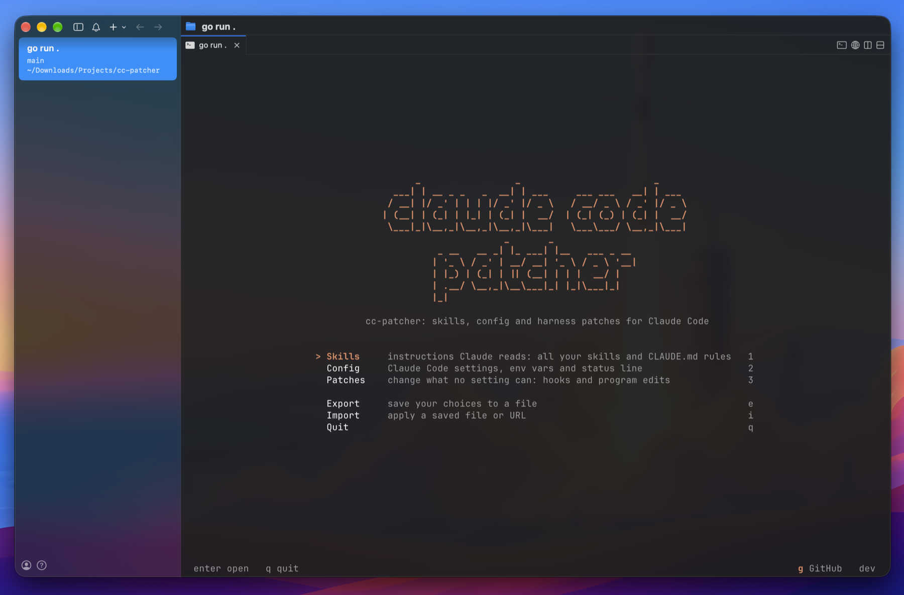
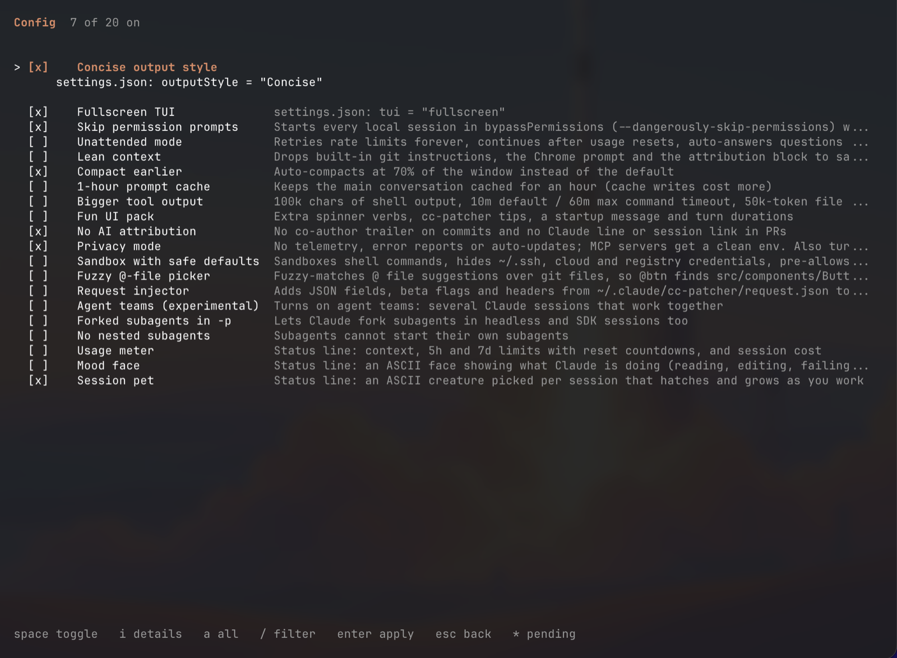

# cc-patcher

A terminal app that sets up Claude Code the way you like it, in one place, on any machine.

Claude Code is configured through a pile of files: `settings.json`, `CLAUDE.md`, hook scripts, skills folders, environment variables. cc-patcher puts all of it behind one checklist. Tick what you want, press enter, and it writes the files for you. Untick it and the change is undone, including any value it replaced.



## Install or update

macOS and Linux:

```sh
curl -fsSL https://raw.githubusercontent.com/aveekpatra/cc-patcher/main/install.sh | sh
```

Windows (PowerShell):

```powershell
irm https://raw.githubusercontent.com/aveekpatra/cc-patcher/main/install.ps1 | iex
```

Run the same command again to update. Then start it with `cc-patcher`.

## What it does

- **Patches**: change what no setting can. They run inside Claude Code as hooks, using the cc-patcher binary itself, so they need no Python or Node. Items marked with a red `!` go further and edit Claude Code's own program files.
- **Config**: change what Claude Code already lets you set: `settings.json` keys, environment variables, the status line, alone or as presets.
- **Skills**: instructions Claude reads. Install or remove any skill in `~/.claude/skills`, yours or bundled or downloaded from GitHub, and switch always-on `CLAUDE.md` rules on and off.




Every item shows what it changes before you turn it on. Use `/` to filter, `space` to tick, `enter` to apply.

## Back up and replicate your setup

One file holds your whole user-level Claude Code setup: `settings.json`, `CLAUDE.md`, keybindings, every skill (yours included, linked ones copied in), agents, slash commands, output styles, hooks, themes, user MCP servers, and your cc-patcher choices.

```sh
cc-patcher export my-setup.json      # or press e on the home screen
cc-patcher import my-setup.json      # a file or an https:// URL; or press i
```

- Values that look like secrets (tokens, keys, passwords, auth headers) are redacted unless you export with `--with-secrets`. On import, a redacted value keeps whatever the target machine already has.
- Paths under your home folder are rewritten for the new machine.
- Files the import replaces are saved first in `~/.claude/cc-patcher/restore-<time>/`. MCP servers the target already has are left alone.
- Not included: chat history, sessions, caches, login credentials, project-level `.claude` folders, and installed plugins (their settings come along; reinstall the plugins with `/plugin`).

## Good to know

- The first time cc-patcher edits `~/.claude/settings.json`, it saves the original next to it as `settings.json.cc-patcher.bak`.
- Patches point at the cc-patcher binary by its full path. If you move it, turn the patches off and on again.
- Set `CLAUDE_CONFIG_DIR` to try it against a scratch folder first: `CLAUDE_CONFIG_DIR=/tmp/cc-test cc-patcher`.

## Contributing

Issues and pull requests are welcome. To build from source you need Go:

```sh
go run .
go test ./...
```

A bundled skill is a folder with a `SKILL.md` under `skills/`. Releases are built by GitHub Actions when a `v*` tag is pushed.

## License

GPL-3.0. Free and open source.
