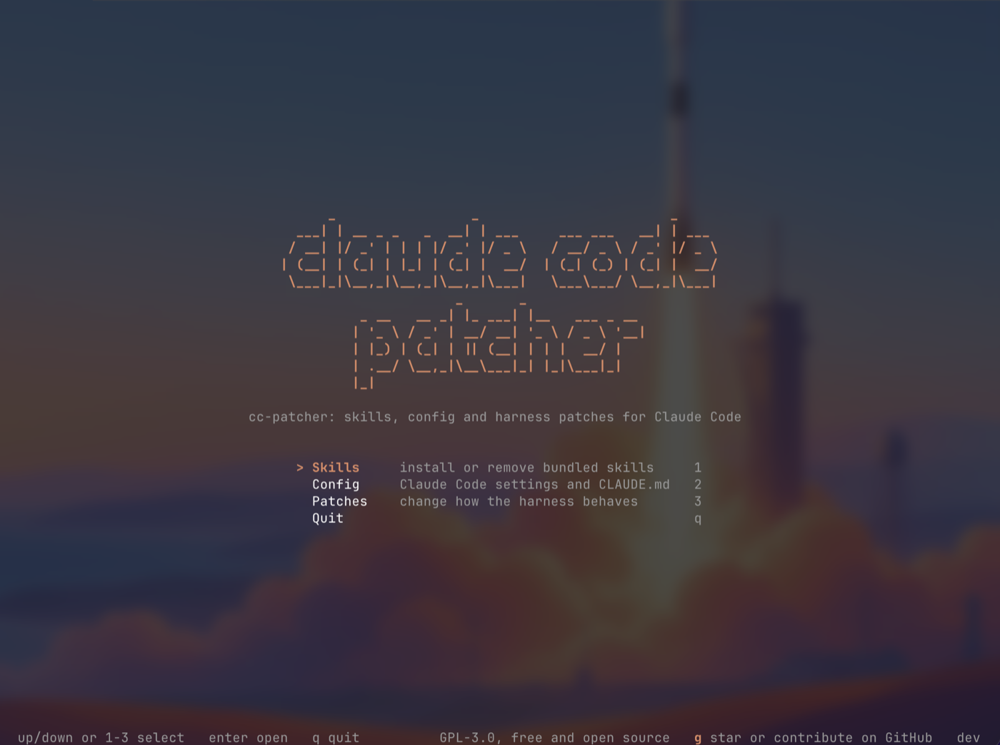
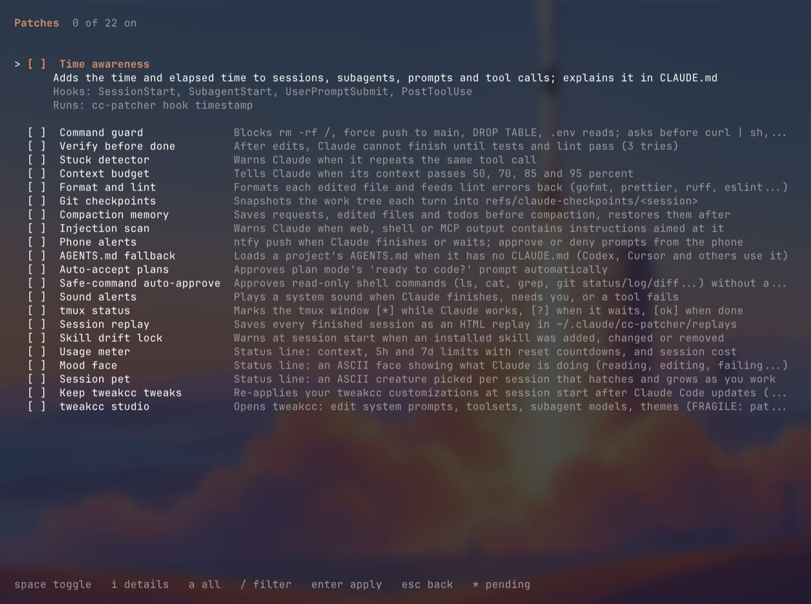

# cc-patcher

A terminal app that sets up Claude Code the way you like it, in one place, on any machine.

Claude Code is configured through a pile of files: `settings.json`, `CLAUDE.md`, hook scripts, skills folders, environment variables. cc-patcher puts all of it behind one checklist. Tick what you want, press enter, and it writes the files for you. Untick it and the change is undone, including any value it replaced.



## Install or update

macOS and Linux:

```sh
curl -fsSL https://raw.githubusercontent.com/aveekpatra/cc-patcher/main/install.sh | sh
```

Windows (PowerShell):

```powershell
irm https://raw.githubusercontent.com/aveekpatra/cc-patcher/main/install.ps1 | iex
```

Run the same command again to update. Then start it with `cc-patcher`.

## What it does

- **Skills**: install or remove skills in `~/.claude/skills`. Some ship inside cc-patcher, others download from GitHub when you pick them.
- **Config**: switch Claude Code settings and `CLAUDE.md` instructions on and off, alone or as presets.
- **Patches**: change how Claude Code behaves while it works: what it sees, what it is allowed to run, what happens when it finishes. Patches run as hooks inside Claude Code, using the cc-patcher binary itself, so they need no Python or Node.



Every item shows what it changes before you turn it on. Use `/` to filter, `space` to tick, `enter` to apply.

## Good to know

- The first time cc-patcher edits `~/.claude/settings.json`, it saves the original next to it as `settings.json.cc-patcher.bak`.
- Patches point at the cc-patcher binary by its full path. If you move it, turn the patches off and on again.
- Set `CLAUDE_CONFIG_DIR` to try it against a scratch folder first: `CLAUDE_CONFIG_DIR=/tmp/cc-test cc-patcher`.

## Contributing

Issues and pull requests are welcome. To build from source you need Go:

```sh
go run .
go test ./...
```

A bundled skill is a folder with a `SKILL.md` under `skills/`. Releases are built by GitHub Actions when a `v*` tag is pushed.

## License

GPL-3.0. Free and open source.
